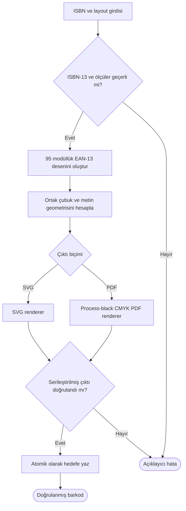

# BookBarcode

BookBarcode is a dependency-free Python package and agent-tools capability for
deterministic ISBN-13/EAN-13 barcode generation.

It produces:

* editable, millimetre-sized SVG with process-black CMYK intent metadata;
* print-ready PDF using the real `0 0 0 1 k` CMYK operator;
* structured verification reports for both artifact formats.

The default KDY layout is 35 x 19 mm. The `minimum` preset is 26 x 14 mm.
Custom dimensions, bar height, and symmetric or independent side margins are
supported. The same `bookbarcode` package powers the Python API, standalone
CLI, and agent-tools JSON adapter.

Documentation:

* [Türkçe kullanım kılavuzu](docs/KULLANIM.md)
* [KDY ölçü ve renk referans notları](docs/KDY-REFERANS-NOTLARI.md)

## Python package

From this directory, install in editable mode during development:

```bash
python3 -m pip install -e .
```

Generate content without writing files:

```python
from bookbarcode import Barcode

barcode = Barcode("9786253798338")
svg_text = barcode.to_svg()
pdf_bytes = barcode.to_pdf()
```

Write verified artifacts explicitly:

```python
from bookbarcode import Barcode, BarcodeLayout

layout = BarcodeLayout(
    width_mm=38,
    height_mm=20,
    side_margin_mm=3,
    bar_height_mm=12.5,
)
barcode = Barcode(
    "9786253798338",
    display_text="ISBN 978-625-379-833-8",
    layout=layout,
)
barcode.write_svg("book-barcode.svg")
barcode.write_pdf("book-barcode.pdf")
```

Existing files are refused unless `overwrite=True` is explicit. Each write uses
a temporary sibling, verifies it, and only then atomically replaces the target.
The output directory must already exist.

## Standalone CLI

After installation:

```bash
bookbarcode 9786253798338 \
  --display "ISBN 978-625-379-833-8" \
  --output /tmp/book-barcode \
  --format both
```

Without installation, run from this directory:

```bash
python3 -m bookbarcode.cli 9786253798338 --output /tmp/book-barcode
```

## Agent-tools JSON interface

From the agent-tools repository root:

```bash
printf '%s' '{
  "operation": "write_barcode",
  "params": {
    "isbn": "9786253798338",
    "display_text": "ISBN 978-625-379-833-8",
    "output_base": "/tmp/book-barcode",
    "layout": {"preset": "normal"}
  }
}' | python3 file-tools/isbn_barcode/isbn_barcode.py
```

Available operations are `generate_svg`, `write_svg`, `write_pdf`,
`write_barcode`, `verify_svg`, and `verify_pdf`.

## Architecture



```text
ISBN validation → EAN-13 modules → shared geometry
                                      ├── SVG renderer
                                      └── PDF renderer

serialized artifact → independent verifier → atomic writer
```

The package is the single source of truth. `tool.py` only translates JSON-like
parameters and responses; it does not duplicate barcode algorithms.

## ISBN display text

When `display_text` is omitted, BookBarcode uses a readable 3-3-3-3-1 fallback.
This does not infer official ISBN registrant ranges. Pass the assigned
hyphenation explicitly when publication metadata requires exact grouping.

## Verification scope

SVG verification checks physical dimensions, EAN modules, guard bars, readable
digits, and CMYK intent. PDF verification checks file framing, page dimensions,
and process-black commands. A production print workflow should still perform
scanner tests and printer preflight.

## Development and packaging

```bash
python3 -m unittest discover -s tests -v
python3 -m build
python3 -m twine check dist/*
```

The distribution version is read from `bookbarcode.__version__`. Before public
release, confirm the package name, choose an explicit license, test the built
wheel in a clean environment, and publish to TestPyPI first.
