# Measurement Dependency DAG

This document is the canonical explanation of BookBarcode's physical
measurement dependencies. It describes domain rules rather than an incidental
Python call graph. Code, tests, and other documentation must remain consistent
with this graph.

All physical values use millimetres. `X` is one EAN-13 module: the narrowest
horizontal bar/space unit. A complete EAN-13 symbol contains exactly 95 modules.

## Edge semantics

The diagram distinguishes two relationship types:

* a solid arrow (`-->`) means **derives from** or **selects from**;
* a dotted arrow (`-.->`) supplies evidence to a **constraint check** and does
  not make the constraint part of the derivation DAG.

The solid-edge graph must remain acyclic.

## Canonical graph

```mermaid
flowchart TD
    subgraph inputs[LayoutSpec inputs]
        W[width_mm]
        H[height_mm]
        SM[side_margin_mm]
        LM[left_margin_mm]
        RM[right_margin_mm]
        BH[bar_height_mm]
    end

    subgraph content[Barcode content inputs]
        ISBN[validated ISBN-13]
        DISPLAY[validated display text]
        EAN[95-module EAN pattern]
    end

    subgraph selection[Source selection]
        LS[left margin source]
        RS[right margin source]
        BHS[data-bar height source]
    end

    subgraph resolved[ResolvedBarcodeLayout]
        X[module_width_mm / X]
        LQ[left_quiet_zone_mm]
        RQ[right_quiet_zone_mm]
        SL[symbol_left_mm]
        SW[symbol_width_mm]
        SR[symbol_right_mm]
        TB[title_baseline_mm]
        TF[title_font_size_mm]
        BT[bar_top_mm]
        DBH[data_bar_height_mm]
        DBB[data_bar_bottom_mm]
        GE[guard_extension_mm]
        GBB[guard_bar_bottom_mm]
        HB[hri_baseline_mm]
        HF[hri_font_size_mm]
    end

    subgraph geometry[BarcodeGeometry]
        TITLE[title geometry]
        BARS[bar rectangles]
        HRI[13 HRI glyph positions]
    end

    subgraph constraints[Constraint checks]
        CL{left quiet zone >= 11X}
        CR{right quiet zone >= 7X}
        CW{quiet zones + symbol = width}
        CF{guard bottom < HRI baseline}
    end

    LM --> LS
    SM --> LS
    RM --> RS
    SM --> RS
    BH --> BHS
    H --> BHS

    W --> X
    LS --> X
    RS --> X
    X --> LQ
    LS --> LQ
    X --> RQ
    RS --> RQ
    LQ --> SL
    X --> SW
    SL --> SR
    SW --> SR

    H --> TB
    H --> TF
    H --> BT
    BHS --> DBH
    BT --> DBB
    DBH --> DBB
    X --> GE
    DBB --> GBB
    GE --> GBB
    H --> HB
    H --> HF

    ISBN --> EAN
    EAN --> BARS
    ISBN --> HRI
    DISPLAY --> TITLE

    TB --> TITLE
    TF --> TITLE
    W --> TITLE
    SL --> BARS
    X --> BARS
    BT --> BARS
    DBH --> BARS
    GE --> BARS
    SL --> HRI
    X --> HRI
    HB --> HRI
    HF --> HRI

    LQ -.-> CL
    X -.-> CL
    RQ -.-> CR
    X -.-> CR
    LQ -.-> CW
    SW -.-> CW
    RQ -.-> CW
    W -.-> CW
    GBB -.-> CF
    HB -.-> CF
```



## Source-selection precedence

The resolver selects optional inputs before calculating dependent values:

```text
left margin source  = left_margin_mm  ?? side_margin_mm ?? standard 11X fallback
right margin source = right_margin_mm ?? side_margin_mm ?? standard 7X fallback
data-bar height      = bar_height_mm   ?? height_mm * 0.62
```

The `??` notation means “use the value on the left when supplied; otherwise
continue to the next source.” Standard quiet-zone fallback is resolved together
with `X`, not as an independent caller input.

## Derivation formulas

| Resolved value | Mandatory relationship |
|---|---|
| `module_width_mm` | Available horizontal width divided by the symbol and any unresolved standard quiet-zone module counts |
| `left_quiet_zone_mm` | Explicit selected source, otherwise `11X` |
| `right_quiet_zone_mm` | Explicit selected source, otherwise `7X` |
| `symbol_left_mm` | `left_quiet_zone_mm` |
| `symbol_width_mm` | `95X` |
| `symbol_right_mm` | `symbol_left_mm + symbol_width_mm` |
| `title_baseline_mm` | `height_mm * 0.14` from the top edge |
| `title_font_size_mm` | `height_mm * 0.11` |
| `bar_top_mm` | `height_mm * 0.19` from the top edge |
| `data_bar_height_mm` | Explicit bar height, otherwise `height_mm * 0.62` |
| `data_bar_bottom_mm` | `bar_top_mm + data_bar_height_mm` |
| `guard_extension_mm` | `5X` |
| `guard_bar_bottom_mm` | `data_bar_bottom_mm + guard_extension_mm` |
| `hri_baseline_mm` | `height_mm * 0.94` from the top edge |
| `hri_font_size_mm` | `height_mm * 0.145` |

## Margin cases used to resolve X

| Explicit effective margins | Formula |
|---|---|
| Neither side | `X = width / (11 + 95 + 7)` |
| Right only | `X = (width - right) / (11 + 95)` |
| Left only | `X = (width - left) / (95 + 7)` |
| Both sides | `X = (width - left - right) / 95` |

Every result must additionally satisfy the `11X` left and `7X` right minimum
quiet-zone constraints. An explicit margin is not permission to create a
non-standard barcode.

## Topological resolution order

`resolve_layout()` follows this dependency order:

1. validate primitive `LayoutSpec` values;
2. select effective left and right margin sources;
3. resolve module width `X`;
4. resolve quiet zones and horizontal symbol bounds;
5. resolve vertical positions, heights, and font sizes;
6. materialize an immutable `ResolvedBarcodeLayout`;
7. validate quiet-zone, page-fill, formula, and vertical-fit constraints;
8. combine the resolved layout with ISBN/EAN semantics as `BarcodeGeometry`.

Changing this order is safe only when every dependency remains available before
its consumer and the solid-edge graph remains acyclic.

## Typed code mapping

```text
LayoutSpec
    Caller intent, optional overrides, and source-selection inputs
        |
        v
resolve_layout()
    Deterministic topological resolution and constraint validation
        |
        v
ResolvedBarcodeLayout
    Complete immutable measurement snapshot with no optional values
        |
        v
build_barcode_geometry()
    Combine layout with the ISBN's 95-module EAN pattern
        |
        v
BarcodeGeometry
    Complete title, bar, and HRI geometry consumed by both renderers
```

`BarcodeLayout` remains a backward-compatible, eagerly resolved subclass of
`LayoutSpec`. New code that needs to distinguish caller intent from resolved
measurements should use `LayoutSpec` explicitly.

## Renderer and verifier boundary

SVG and PDF renderers consume the same `BarcodeGeometry`; they must not
recalculate EAN meaning or layout dependencies. Format-specific coordinate and
text-origin conversion remains a serialization concern.

Artifact verifiers may use `resolve_layout()` to understand the caller's
expected physical layout, but they must inspect serialized output independently.
They must not trust `BarcodeGeometry` or renderer output inputs as proof that an
artifact is correct.

## Required test evidence

Tests protecting this DAG must cover:

* all four margin-source cases used to resolve `X`;
* `95X` symbol width and total page-width composition;
* exact and failing `11X`/`7X` quiet-zone boundaries;
* proportional and explicit data-bar height sources;
* `5X` guard extension;
* derived data/guard bar bottoms and vertical-fit rejection;
* complete immutable resolved values;
* complete shared title, bar, and HRI geometry;
* equivalent serialized geometry in SVG and PDF.

## Change policy

Any change to a node, formula, edge, source precedence, or constraint in this
document is a geometry or public-layout change. Update the resolver, focused
unit tests, both renderers where affected, independent verifiers, user guides,
and the agent contract in the same change.
